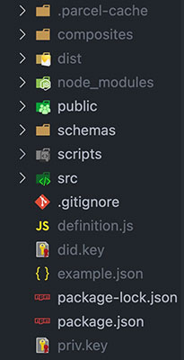

# Darqnet x ComposeDB Demo

Be sure to follow these instructions _exactly_ as written to ensure proper configuration so you can play around with the web app locally. It's assumed that you already have the ComposeDB CLI installed on your system.

For convenience and less headache, there are a few shell scripts that you'll execute with `npm run` to set up the Ceramic Daemon and create the GraphQL composites with ComposeDB.

## Initial Setup

1. Download the code from this repository and run `npm install`.
2. Create your Private Key: run `composedb did:generate-private-key` and put it in a file **in the root project folder** named `priv.key`.
3. Create a DID key from that private key: run `composedb did:from-private-key $(cat priv.key)` and put it in a file named `did.key`, **also in the root project folder.**
4. Run `npm run daemon` at least once until the Ceramic Daemon is successfully running, and then terminate the process.
5. You will need to find the `.ceramic/daemon.config.json` file on your system and paste in the DID key to the `admin-dids` field in the JSON. Save the file.
6. Run `npm run daemon` to relaunch the Ceramic Daemon, which should now be running successfully with your admin DID (you should be able to see the admin DID in the CLI messages when the Daemon runs).
7. In a new, separate terminal window, run `npm run prep` to create the `ritual.json` file found in the `composites` directory.
8. Copy the StreamID from the newly created `composites/ritual.json` file and paste it into the `id` argument of the `@loadModel` directive for `DemoRitual` in `schemas/Shard.graphql`
9. Run `npm run comp` to create the needed composites for ComposeDB, which will all appear in the `composites` directory.
10. Copy the entirety of the `composites/demo-runtime.json` file.
11. In the root project folder, create a `definition.js` file. In the file, type `export const definition =` and then paste the `demo-runtime.json` file contents in.
12. For good measure, terminate the Ceramic Daemon process and restart it with `npm run daemon`. Then run `npm run dev` to spin up the application in a dev server.
13. Check the browser console. If all is successful, then you should see a logged message showing the model resources that are being used.
14. If for whatever reason you want to spin up graphiql to test some queries outside of the app, you can run `npm run gql` to do so.
15. From there, you should be good to test the web app! The below image shows roughly what your root project structure should look like:

## Ideal Root Directory Structure

## If you need to reset...

If you want to make any changes to the models and need to recreate the composites (or if you're experiencing some unknown error and just need a clean slate), you need to find the `.ceramic` directory in your system to delete it (it will be recreated when you run `npm run daemon`) so you can recreate it as a blank slate. Remember to re-add the admin DID to the `daemon.config.json` file if you do so.

Remember to copy and paste the new `composites/demo-runtime.json` composite into the `definition.js` file after following the previous steps in the process as outlined above.

Delete the `.parcel-cache` and `dist` directories before building the dev server again after recreating composites / restarting the Ceramic node to have the newest models loaded into the web app.
